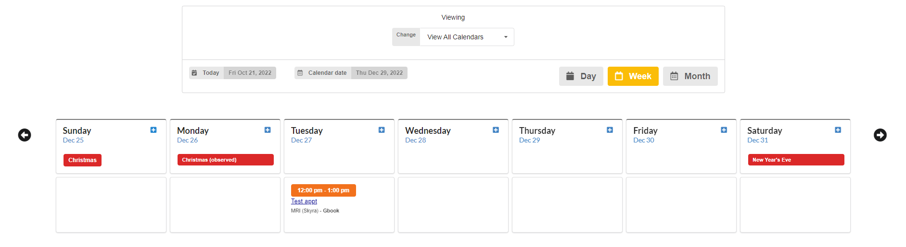

# 🐿️ NeuroInformatics Database

<figure><figcaption>
The NiDB logo
</figcaption></figure>

## Overview

The Neuroinformatics Database (NiDB) is designed to store, retrieve, analyze, and share neuroimaging data. Modalities include MR, EEG, ET, video, genetics, assessment data, and any binary data. Subject demographics, family relationships, and data imported from RedCap can be stored and queried in the database.

#### Features

* .rpm based installation for CentOS 8, RHEL 8, Rocky Linux 8 (not for CentOS Stream)
* Store any neuroimaging data, including MR, CT, EEG, ET, Video, Task, GSR, Consent, MEG, TMS, and more
* Store any assessment data (paper-based tasks)
* Store clinical trial information (manage data across multiple days & dose times, etc)
* Built-in DICOM receiver. Send DICOM data from PACS or MRI directly to NiDB
* Bulk import of imaging data
* User and project based permissions, with project admin roles
* Search and manipulate data from subjects across projects
* Automated imaging analysis pipeline system
* "Mini-pipeline" module to process behavioral data files (extract timings)
* All stored data is searchable. Combine results from pipelines, QC output, behavioral data, and more in one searchable
* Export data to NFS, FTP, Web download, NDA (NIMH Data Archive format), or export to a remote NiDB server
* Export to squirrel format
* Project level checklists for imaging data
* Automated motion correction and other QC for MRI data
* Calendar for scheduling equipment and rooms
* Usage reports, audits, tape backup module
* Intuitive, modern UI. Easy to use

## Features

### .rpm based installation & upgrade

Install or upgrade NiDB in minutes on RHEL compatible Linux OS.

### Automated import of DICOM data

DICOM data can be automatically imported using the included `dcmrcv` DICOM receiver. Setup your MRI or other DICOM compatible device to send images to NiDB, and NiDB will automatically archive them. Image series can arrive on NiDB in any order: partial series, or full series to overlap incomplete series.

### Store any type of data

Literally **any** type of imaging data: binary; assessment; paper based; genetics. See full list of [supported modalities](contribute/squirrel-data-sharing-format/specification-v1.0/modalities.md). All data is stored in a hierarchy: Subject --> Study --> Series. Data is searchable across project and across subject.

.png>)

### Store clinical trial data

NiDB stores multiple time-points with identifiers for clinical trials; exact day numbers (days 1, 15, 30 ...) or ordinal timepoints (timepoint 1, 2, 3 ...) or both (day1-time1, day1-time2, day2-time1, ... )

### Bulk import of imaging data

Got a batch of DICOMs from a collaborator, or from an old DVD? Import them easily

<figure><figcaption></figcaption></figure>

### Search and export imaging data

Find imaging data from any project (that you have permissions to...) and export data. Search by dozens of criteria.

<figure><figcaption></figcaption></figure>

### Export to multiple formats

**Image formats**

* Original raw data - DICOM, Par/Rec, Nifti
  * Anonymized DICOM data: partial and full anonymization
* Nifti3d
* Nifti3dgz
* Nifti4d
* Nifti4dgz
* squirrel

**Package formats**

* squirrel
* BIDS
* NDA/NDAR

**Destinations**

* NFS share
* Web
* Public download/dataset
* Local FTP
* Remote NiDB instance

### Search and export non-imaging data

Data obtained from pipeline analysis, imported and locally generated measures, drugs, vitals, measures, are all searchable.

<figure><figcaption></figcaption></figure>

### Full analysis pipeline system

From raw data to analyzed, and storing result values/images. Utilize a compute cluster to process jobs in parallel. Example below, 200,000 hrs of compute time completed in a few weeks. Hundreds of thousands of result values automatically stored in NiDB and are searchable.

<figure><figcaption>
Overview of a pipeline
</figcaption></figure>

<figure><figcaption>
List of analyses for a pipeline
</figcaption></figure>

### Automated MR quality control

Large number of automatically generated metrics. Metrics are exportable as .csv and tables.

<figure><figcaption>
Basic motion QC on the study view page
</figcaption></figure> <figure><figcaption>
Detailed QC
</figcaption></figure>

### Calendar

Fully featured calendar, running securely on your internal network. Repeating appts, blocking appts, and time requests.

<figure><figcaption>
Week view, showing US holidays
</figcaption></figure>

## Publications

* Book GA, Anderson BM, Stevens MC, Glahn DC, Assaf M, Pearlson GD. Neuroinformatics Database (NiDB)--a modular, portable database for the storage, analysis, and sharing of neuroimaging data. Neuroinformatics. 2013 Oct;11(4):495-505. doi: 10.1007/s12021-013-9194-1. PMID: 23912507; PMCID: PMC3864015. https://pubmed.ncbi.nlm.nih.gov/23912507/
* Book GA, Stevens MC, Assaf M, Glahn DC, Pearlson GD. Neuroimaging data sharing on the neuroinformatics database platform. Neuroimage. 2016 Jan 1;124(Pt B):1089-1092. doi: 10.1016/j.neuroimage.2015.04.022. Epub 2015 Apr 16. PMID: 25888923; PMCID: PMC4608854. https://pubmed.ncbi.nlm.nih.gov/25888923/

**Outdated information** Watch an overview of the main features of NiDB (recorded 2015, so it's a little outdated): [Part 1](https://youtu.be/tOX7VamHGvM) | [Part 2](https://youtu.be/dX11HRj_kEs) | [Part 3](https://youtu.be/aovrq-oKO-M)

## Documentation

### Getting Started


[installation](getting-started/installation/)



[upgrade](getting-started/upgrade/)


### Using NiDB


[users-guide](using-nidb/users-guide/)



[administration](using-nidb/administration/)


### Advanced


[building-nidb.md](contribute/building-nidb.md)



[squirrel-data-sharing-format](contribute/squirrel-data-sharing-format/)

