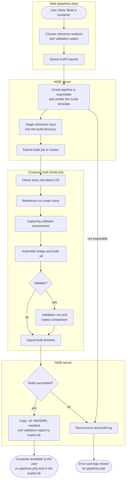

# Exporting a pipeline as an Apptainer container

Design notes for exporting a NiDB pipeline as a standalone Apptainer (`.sif`) image that anyone can run without NiDB. Written 2026-10-05, updated 2026-10-06 with design decisions (§11); **draft, nothing is implemented yet**.

Companion docs: `doc/pipeline-execution.md` (how a pipeline runs today), `doc/analysis-api.md` (the check-in API that the container will *not* use).

---

## 1. Goal

The container is a **portable version of an established, debugged level-1 pipeline**, for people who don't have NiDB. One version of a pipeline (a row in `pipelines` plus its `pipeline_steps` and `pipeline_data_def` rows) becomes one generic image, which is run once per subject/study:

```
apptainer run --bind /data/sub01:/input --bind /results/sub01:/output mypipeline-v3.sif \
    --subjectuid S1234ABC --studynum 2 --studydatetime "2024-03-01 10:15:00"
```

The image contains exactly four things:

| Item | Path in image | Notes |
|---|---|---|
| Input directory | `/input` | Empty mount point. The caller binds their data here; no data is baked into the image. See §6 for the expected layout. |
| Main script | `/pipeline/run.sh` + `/pipeline/run.sh.template` | The pipeline's main script steps, rendered from the NiDB definition. See §3–§4. |
| Software | same paths as on the compute node (`/opt/fsl`, `/usr/bin/R`, ...) | Captured from the compute node where the pipeline runs today. See §7. |
| Output directory | `/output` | Empty mount point. The caller binds a writable directory here. |

Plus a small, non-executed `/pipeline/manifest.json` (§6) describing the pipeline, variables, and input layout, so the image documents itself.

**Not in the image:** `nidb cluster` check-ins, `nidbapi`, step log redirection, supplement steps, the result script, the `useTmpDir` copy, `chmod 777`, scheduler headers, the API token, or anything else that is NiDB-specific or talks to the NiDB database or web server.

**Only level-1 (subject/study level) pipelines can be exported.** Export refuses level-0 (deprecated) and level-2 (group) pipelines.

---

## 2. What changes compared to the NiDB job file

`CreateClusterJobFile()` (`modulePipeline.cpp:2072`) builds the job script. The container script keeps only the main step commands and drops everything else:

| Job file element | Container |
|---|---|
| `#SBATCH` / `#$` headers, `LD_LIBRARY_PATH` | Dropped. The caller schedules the container however they like. |
| `NIDB_*` exports, `nidbapi()` function | Dropped |
| `nidb cluster -u pipelinecheckin ...` lines | Dropped |
| `cd <analysispath>` | `cd /output` |
| `useTmpDir` copy in/out | Dropped. The caller can bind a scratch directory as `/output` if they want local disk. |
| Step check-in + `echo Running ...` | Replaced with a plain `echo "== Step N: <description>"` to stdout |
| `{NOLOG}`, `{NOCHECKIN}`, `{PROFILE}` flags | Stripped from the text. `PROFILE` is not honored. |
| `>> <analysispath>/pipeline/StepN` log redirect | Dropped. Output goes to the container's stdout/stderr. |
| `cd <workingdir>` | Kept, after its variables are rendered (see §4 note about `workingdir`) |
| Disabled steps (`# command`) | Kept as comments, so the script still matches the NiDB step numbering |
| Supplement steps | Not exported. Supplements exist to augment an existing NiDB analysis during testing; the container runs a finished pipeline once. |
| Result script (`pipeline_resultsscript`) | Dropped. It exists to insert results into NiDB. |
| `updateanalysis` / `setcomplete` / final `chmod` | Dropped |

### In-place working directory

NiDB pipelines run *inside* the analysis directory: the data is downloaded into `<analysisroot>`, and steps write their outputs next to it, referring to everything as `{analysisrootdir}/...`. Existing scripts depend on that, so the container keeps the same model:

1. `run.sh` copies `/input/.` to `/output/` (`cp -a`).
2. `cd /output`.
3. `{analysisrootdir}` is `/output`.

So `/output` ends up looking like a NiDB analysis directory after the pipeline has run. That copy costs disk space and time for large inputs. An alternative is `--bind /data/sub01:/output` (read-write, in place), with `run.sh` skipping the copy if `/input` is empty. Both should work.

---

## 3. Pipeline variables

These are all the substitutions `FormatCommand()` (`modulePipeline.cpp:2008`) performs today, and what each becomes in the container.

**Export time** means NiDB replaces the token while building the image. **Runtime** means `run.sh` replaces it at startup.

| Variable | NiDB value | Container treatment |
|---|---|---|
| `{analysisrootdir}` | `<analysisroot>/...` path on shared storage | **Runtime:** always `/output` in the container. Kept as a token in the template (not baked in) so the build's trace run (§7) can render the same template to a scratch directory on the compute node. |
| `{pipelinename}` | `pipelines.pipeline_name` | **Export time:** constant |
| `{workingdir}` | The step's `ps_workingdir` | **Export time:** that step's working directory, rendered |
| `{description}` | The step's `ps_description` | **Export time:** constant, per step |
| `{subjectuid}` | Subject UID | **Runtime:** `--subjectuid` (required if used) |
| `{studynum}` | Study number | **Runtime:** `--studynum` (required if used) |
| `{uidstudynum}` | UID + studynum, concatenated | Converted to `{subjectuid}{studynum}` at export |
| `{studydatetime}` | `yyyy-MM-dd hh:mm:ss` | **Runtime:** `--studydatetime` (required if used) |
| `{analysisid}` | `analysis.analysis_id` | Not meaningful without NiDB, and not a runtime parameter. **Export time:** replaced with `0`, with a warning. `0` rather than an empty string, so a path like `/tmp/{analysisid}` can't collapse to `/tmp/`. |
| `{groups}`, `{uidstudynums}`, `{uidstudynums_<group>}`, `{numsubjects}`, `{numsubjects_<group>}` | Group-level, from live DB queries | Only meaningful for level-2 pipelines, which can't be exported. If one appears in a level-1 pipeline, **export fails** with an error naming the step. |
| `{NOLOG}`, `{NOCHECKIN}`, `{PROFILE}` | Flags | **Export time:** removed |
| `{command}` | Deprecated. Removed from the command by `FormatCommand()`, and flagged as a warning in the pipeline checks | **Export time:** removed, with a warning |
| `{first_*_file}` etc. | Already deprecated, not expanded | **Export time:** error |

So an exported pipeline needs at most **three runtime values**: `subjectuid`, `studynum`, `studydatetime`. The manifest records which ones the script actually uses, and `run.sh` only requires those.

Any other `{...}` token left after export is an error. This catches typos that NiDB silently leaves alone today.

---

## 4. How the substitution works

### Option chosen: text rendering at startup (same semantics as NiDB)

The image stores `run.sh.template`, with the runtime tokens still in their `{...}` form. At startup, `run.sh` replaces them with the argument values, writes `/tmp/run-rendered.sh`, and runs it with `bash`. This is exactly what NiDB does today (plain text replacement before bash ever sees the script), so a command behaves identically in both places, including inside single quotes, quoted heredocs, `awk` programs, and generated filenames.

### Option rejected: replace tokens with shell variables

Replacing `{subjectuid}` with `${SUBJECTUID}` at export would be simpler, but it changes behavior:
- `echo '{subjectuid}'` would print a literal `${SUBJECTUID}`;
- a `cat <<'EOF'` heredoc wouldn't expand it;
- `awk '{print "{subjectuid}"}'` would break.

Real pipeline steps do all of these.

### Details

- **Case.** `FormatCommand()` matches case-insensitively (`{SubjectUID}` works). At export, NiDB rewrites every recognized token to lowercase with a `QRegularExpression::CaseInsensitiveOption` pass. That way the bash renderer only needs exact matches.
- **Substitution in bash.** Use `${line//"{subjectuid}"/"$SUBJECTUID"}` with *both* sides quoted. Quoting the replacement matters: bash 5.2 has `patsub_replacement` enabled by default, where an unquoted `&` in the replacement means "the matched text." (CentOS 7 has bash 4.2, which doesn't have that option, but quoting is correct on both.)
- **Validation (required).** Rendered values become shell code, so `run.sh` must reject bad input before it renders anything:
  - `subjectuid` must match `^[A-Za-z0-9_-]+$`;
  - `studynum` must match `^[0-9]+$`;
  - `studydatetime` must match `^[0-9]{4}-[0-9]{2}-[0-9]{2} [0-9]{2}:[0-9]{2}:[0-9]{2}$`.

  In NiDB these values come from the database. In the container they come from whoever runs it.
- **Error handling.** The NiDB job file doesn't use `set -e`: a failing step doesn't stop later steps. The container keeps that by default, so results match, and `--stop-on-error` turns on `set -e`. `run.sh` exits with the status of the last step.
- **`workingdir`.** NiDB writes `cd <workingdir>` *without* passing it through `FormatCommand()` (`modulePipeline.cpp:2284`), so a working directory of `{analysisrootdir}/fsl` currently `cd`s to a literal `{analysisrootdir}/fsl`. Export should render it. This is also worth fixing in the NiDB job file itself.

### Example

Pipeline step 2 in NiDB:

```
cd {analysisrootdir}; bet T1/{SubjectUID}_t1.nii.gz T1/brain {NOLOG}   # Skull strip
```

`run.sh.template` after export:

```bash
# Step 2: Skull strip
echo "== Step 2: Skull strip"
cd {analysisrootdir}; bet T1/{subjectuid}_t1.nii.gz T1/brain
```

Rendered at runtime with `--subjectuid S1234ABC`:

```bash
cd /output; bet T1/S1234ABC_t1.nii.gz T1/brain
```

### `run.sh` (fixed, same for every pipeline)

```bash
#!/bin/bash
# usage: run.sh --subjectuid UID --studynum N --studydatetime "YYYY-MM-DD hh:mm:ss" [--stop-on-error]
# parse args; check against the validation rules above; check that every variable in
#   /pipeline/manifest.json "requiredVariables" was given
# if /input is non-empty: cp -a /input/. /output/
# render /pipeline/run.sh.template -> /tmp/run-rendered.sh ({analysisrootdir} -> /output, quoted ${//} substitutions)
# cd /output; exec bash [-e] /tmp/run-rendered.sh
```

Writing `run.sh` once in the repo (`src/setup/apptainer/run.sh`) and copying it into every image keeps the per-pipeline output down to the template and the manifest. It must work with bash 4.2 (CentOS 7) and avoid tools that may be missing from a minimal base image (no `jq`: the build writes `requiredVariables` into a plain-text file next to the manifest).

---

## 5. Absolute paths in step commands

Step commands often contain absolute paths. Most are handled automatically by the trace (§7), which captures whatever the pipeline actually touched. Two kinds are checked at export, before anything runs:

| Kind | Example | Handling |
|---|---|---|
| The pipeline's own analysis root | `/nidb/data/analysis/S1234ABC/2/mypipe/...` written literally instead of `{analysisrootdir}` | Error: the user must change the step to use `{analysisrootdir}` |
| NiDB archive or other pipelines' analysis dirs | `/nidb/data/archive/...` | Error: data has to come in through `/input` |

Detection compares path-like tokens in the commands against `cfg[archivedir]`, `cfg[analysisdir]`, `cfg[analysisdirb]`, and the `analysisdirs` table.

---

## 6. Input layout and the manifest

The container doesn't download data. The caller has to provide `/input` laid out the way `GetData()` would have staged it (`doc/pipeline-execution.md` §6):

- per data step: `<pdd_location>/[<seriesnum>/][<phasedir>/]` holding files in `pdd_dataformat` (`dicom`, `nifti3d`, `nifti4d`, ... gzipped if `pdd_gzip`);
- behavioral data at the location given by `pdd_behformat` / `pdd_behdir`;
- or, if `pipeline_outputbids` is set, a BIDS dataset in `<BIDSoutputDir>`;
- if the pipeline has a parent: the parent pipeline's output in `pipeline_dependencydir` (or the root).

`/pipeline/manifest.json` records:
- this input layout;
- the pipeline name, version, description, and the date and NiDB instance it was exported from;
- `requiredVariables`;
- the base OS and the captured software (system packages with versions, `/opt` directories, other paths), from §7;
- any export warnings;
- the full squirrel pipeline JSON, reused from `pipeline::GetSquirrelObject()`, so the image can be re-imported into a NiDB instance later.

`apptainer run-help` shows a readable summary, generated into `%help`. The same text goes into a `README.txt` next to the `.sif` in the export directory (§8).

---

## 7. Capturing the software (the hard part)

Real pipelines use whatever is on the compute node: software in `/opt` installed by the sysadmin, and system software (R, perl, python, tcsh, their libraries and add-on packages) from the node's OS. NiDB has no record of which. So the build **runs on a compute node where the pipeline runs today**, and finds out by running the pipeline once.

### Why a compute node and not the NiDB server

Strictly, `apptainer build` only *copies* files and never runs the host's software, so the image itself could be assembled anywhere that can read the files. But everything needed to decide *what* to copy is on the compute node:
- `/opt` is often local to the nodes, or mounted only on the cluster;
- the system libraries, R/perl add-on packages and package database that matter are the node's, not the NiDB server's (which may be a different OS release entirely);
- the only reliable way to find what a free-form script uses is to run it there and watch.

So discovery and build happen in one job on a compute node, in the pipeline's own queue.

### Step 1: a reference run under `strace`

The export is based on a **reference analysis**: a completed, not-bad analysis of this pipeline version, picked by the user (default: the most recent one).
- NiDB stages that study's input again into the build directory, using `GetData()` and the dependency copy. Today those write into the analysis directory and log against an analysis row, so they need a small refactor to stage into an arbitrary directory.
- The build job renders `run.sh.template` with the reference study's values and `{analysisrootdir}` set to a scratch directory, and runs it under `strace -f -e trace=file,process -o trace.log`.
- It runs in a login shell, like the pipeline job (`#!/bin/bash -l`), and dumps the environment (`env`) at the start.

This runs the pipeline once on a compute node. That's cheap for an established pipeline, but for something like FreeSurfer it's many hours.

### Step 2: sort what was touched

Every existing file opened or executed, outside the scratch directory and `/proc`, `/sys`, `/dev`, `/tmp`, is sorted:

| Kind | How it's found | What gets copied |
|---|---|---|
| Owned by a system package (`/usr/bin/R`, `libgomp.so.1`, perl modules from the distro) | The node's package manager: `rpm -qf <file>` (RHEL family, SUSE, Fedora) or `dpkg -S <file>` (Debian, Ubuntu) | **The whole package** (`rpm -ql` / `dpkg -L`), at the node's installed version. Copying the whole package covers files the reference run didn't happen to touch, and pins the exact versions without needing a working package repo. |
| Under `/opt/<name>` | path | The whole `/opt/<name>` directory |
| Language add-on libraries not owned by a package (R site library, CPAN modules, python packages installed under `/usr/local`) | path matches a known library root for the OS family (§7 "Supported OSes") | That whole library root, so any add-on package the script loads conditionally is included |
| Other unowned files (`/usr/local/bin/foo`, user scripts in `/home/...`) | everything else | The file. For a script directory named in the step commands, the whole directory. |

If the node has neither `rpm` nor `dpkg` (or the package database is unusable), everything is treated as an unowned file. The image then gets exactly what the trace and the `ldd` pass found. That still works, but it's less complete, and the export log says so.

Then:
- a `ldd` pass over every copied ELF file adds any shared library the trace missed (resolved again through the package manager);
- **environment:** variables from the login environment that point into copied paths, or are known tool settings (`PATH`, `LD_LIBRARY_PATH`, `*DIR`, `*_HOME`, `FSLOUTPUTTYPE`, `R_LIBS*`, `PERL5LIB`, ...) go into the image's environment. Scheduler, user, and NiDB variables (`SLURM_*`, `SGE_*`, `NIDB_*`, `HOME`, `USER`, `SSH_*`) don't. Apptainer doesn't source `/etc/profile.d` from the image, so this is needed even when the `profile.d` files are copied.
- **deny list, never copied even if touched:** `/etc/shadow`, `/etc/gshadow`, `/etc/munge/`, `/etc/ssh/*_key`, `*.keytab`, `/etc/sssd/`, `~/.ssh/`, `nidb.cfg`, and known license files (FreeSurfer `license.txt`, MATLAB `licenses/`). Excluded files are listed in the export log. FreeSurfer's license must then be bound at runtime (`--bind license.txt:/opt/freesurfer/license.txt`).

A copy of the node's whole root filesystem was considered and rejected: it's simpler and covers every code path, but it's large and it contains host secrets (munge key, SSH host keys, Kerberos keytabs, SSSD config) that the deny list would have to be perfect about.

A trace only sees the code path that the reference run took. Whole-package and whole-directory copies cover most of the gap. For the rest, the pipeline's container settings on `pipelines.php` allow **extra paths to include** and **paths to exclude**, saved per pipeline version and applied on every export.

### Step 3: base image

The feature is **neutral about the cluster OS**: any Linux distribution should work. The base is **the same OS release as the compute node**, read from `ID` and `VERSION_ID` in `/etc/os-release` and looked up in a mapping table in `build-container.sh` (e.g. `centos 7` → `docker://centos:7.9.2009`, `rocky 8` → `docker://rockylinux:8`, `ubuntu 22.04` → `docker://ubuntu:22.04`). The captured package files are laid over it, so the image ends up with the node's versions of everything the pipeline uses, and the base's own (possibly older) versions of everything else. No package manager runs during the build, so no repos are needed.

If the node's OS isn't in the mapping table, the build stops with a clear message, unless the pipeline's container settings name a base image explicitly. That override is also how to use a pre-pulled `.sif` on shared storage.

### Supported OSes

The design is distribution-neutral, but each OS family needs a few facts. A family counts as **supported** once a real pipeline has been exported from it and the image has run successfully on a different machine. The facts per family:
- package manager commands;
- base image name pattern;
- language library roots.

| OS family | Package manager | Base image | Language library roots (unowned add-ons) | Status |
|---|---|---|---|---|
| RHEL family: CentOS 7, Rocky/Alma 8–9, RHEL | `rpm -qf` / `rpm -ql` | `centos:7.9.2009`, `rockylinux:<N>`, `almalinux:<N>` (RHEL nodes: Rocky/Alma of the same major version, since the RHEL UBI images are incomplete) | `/usr/lib64/R/library`, `/usr/local/lib64/R/library`, `/usr/local/share/perl5`, `/usr/local/lib64/perl5`, `/usr/local/lib/python*/site-packages`, `/usr/local/lib64/python*/site-packages` | Untested |
| Debian / Ubuntu | `dpkg -S` / `dpkg -L` | `debian:<N>`, `ubuntu:<N>` | `/usr/local/lib/R/site-library`, `/usr/lib/R/site-library`, `/usr/local/share/perl/*`, `/usr/local/lib/x86_64-linux-gnu/perl/*`, `/usr/local/lib/python*/dist-packages` | Untested |
| SUSE (openSUSE Leap, SLES) | `rpm -qf` / `rpm -ql` | `opensuse/leap:<N>` | as RHEL family | Untested |
| Anything else | none (trace + `ldd` only) | explicit override required | none | Not supported, but may work |

The library roots are a starting point. `R_LIBS*`, `PERL5LIB` and `PYTHONPATH` from the node's login environment are added to them automatically. This table should be updated as each OS is tested, and a copy of the supported list goes into the user documentation.

### End-of-life OS images (a primary objective)

Preserving pipelines on the OS they were built and validated on is one of the main goals of this feature. CentOS 7 is used as the example below, but the same applies to any old release (Ubuntu 16.04/18.04, Debian 9, ...). A typical case is a pipeline that runs on CentOS 7 nodes, which will eventually be upgraded or retired. Apptainer handles this well: only the host kernel and Apptainer itself matter at runtime, and an EL9 kernel runs a CentOS 7 userspace.

- **Export while the old nodes still exist.** Because the software is captured from the node, a CentOS 7 pipeline must be exported from a CentOS 7 node. Once the nodes are upgraded, the node's R, perl and system libraries for that pipeline are gone. Recovery then means rebuilding from the CentOS 7 archive repos (`vault.centos.org`), with `%post` package installs. That needs `--fakeroot` builds, and it doesn't reproduce the exact package versions. This is a strong reason to export pipelines on old nodes before an OS upgrade.
- **Dead repos don't matter for the normal path.** `docker://centos:7.9.2009` can still be pulled, and since the build copies package files rather than installing them, the defunct `mirrorlist.centos.org` isn't used. Only the fallback above, or extra `%post` installs, needs the repos repointed at the vault and `ca-certificates` updated first.
- **glibc check.** CentOS 7 has glibc 2.17. Old binaries run on newer glibc, but not the reverse. Before building, the job checks the copied `/opt` and other non-package binaries with `objdump -T`. It warns about any that need a newer glibc than the base has, which happens when `/opt` holds software that was built on a newer system.
- **No security updates.** The image carries known, unpatched CVEs. For a batch container with no network services the practical risk is low, but institutional scanners and some HPC centers may flag or block such images. The export writes a warning into the export log, `README.txt` and `manifest.json`.
- **How old.** CentOS 7–era userspaces are fine on current kernels. CentOS 6 and older can hit kernel incompatibilities (e.g. the vsyscall issue) and are not a target.

### Size, licensing, and portability

- **Size.** `/opt/fsl` is ~5 GB and FreeSurfer ~10 GB, so images will be large. squashfs compression helps, and the export reports the image size.
- **Licensing.** Commercial software (MATLAB, ...) must not end up in an image meant to be shared. Beyond the license-file deny list, the export warns when it copies a known commercial install directory. Compiled MATLAB with the MCR is fine.
- **GPU / MPI.** Out of scope for a first version. `--nv` works at runtime if the software supports it.

---

## 8. Build process



1. **Trigger.** A "Build a container" button on `pipelines.php` for a specific pipeline version. It's only enabled for level-1 pipelines with at least one completed analysis. The user picks the reference analysis and whether to run the validation step (on by default; turning it off is useful for long pipelines). A row then goes into a new `pipeline_containers` table with status `pending`.
2. **Prepare (NiDB server).** The `nidb pipeline` module, or a small new module, picks up pending rows. It writes a build directory on shared storage that both the server and the compute nodes can reach, e.g. `cfg[analysisdir]/_apptainer/<pipeline>-v<version>-<id>/`, containing:
   - `run.sh` (fixed), `run.sh.template`, `manifest.json` (partial), `requiredvars.txt`;
   - `input/`: the reference study's input, staged again (§7 step 1);
   - `export.log`: variable and path checks (§3, §5);
   - `build-container.sh` (fixed, from `src/setup/apptainer/`) and `build.job` (sbatch/SGE header plus a call to it, with the reference study's values).
3. **Submit** `build.job` with the existing `nidb::SubmitClusterJob()`, using the pipeline's own cluster and queue settings.
4. **Build (compute node)**, done by `build-container.sh`:
   1. Check that the required tools are present, and fail with a clear message listing any that are missing. Read `/etc/os-release`, choose the base, and choose the package manager (§7 step 3).
   2. Reference run under `strace`, plus the environment dump (§7 step 1).
   3. Sort and collect the files into a staging tree, with the `ldd` pass, deny list and glibc check (§7 step 2).
   4. `apptainer build --sandbox base/ docker://<base>`, then copy the staging tree and `/pipeline/*` into `base/`.
   5. Build the `.sif` from a definition file with `Bootstrap: localimage` / `From: base/` and only `%environment`, `%runscript`, `%labels` and `%help` (no `%post`).
   6. **Validation run (optional):** `apptainer run` the new image on `input/` and compare the output file list with the reference analysis directory. NiDB's `pipeline/` logs, job files and the `completeFiles` check are excluded from the comparison. The results go to `validation.txt`.
   7. Write `build.exitcode`.
5. **Finish (NiDB server).** The module polls for `build.exitcode`. On success it copies `<pipeline>-v<version>.sif`, `README.txt`, `manifest.json` and `validation.txt` to `cfg[exportdir]/NiDB-Apptainer-<pipeline>-v<version>/`. It records the status, path, size and sha256, and deletes the build directory (keeping the logs in the table). Polling means the build job needs no NiDB connection, check-ins or token.

Only `build-container.sh` runs on the node. It doesn't depend on the `nidb` binary on the cluster. It needs only:
- standard Linux tools: `bash`, coreutils, `find`, `ldd`;
- the node's package manager, if there is one;
- `strace`, `objdump` (binutils) and `apptainer`, installed on the nodes for this feature (§8 "Cluster requirements").

`pipeline_containers` columns: `pipelinecontainer_id`, `pipeline_id`, `pipeline_version`, `reference_analysis_id`, `run_validation`, `status` (`pending` / `building` / `complete` / `error`), `create_date`, `build_date`, `base_image`, `sif_path`, `sif_size`, `sif_sha256`, `apptainer_version`, `export_warnings`, `build_log`, `validation_result`.

### Example generated definition file (step 4.5)

```
Bootstrap: localimage
From: base/

%environment
    export FSLDIR=/opt/fsl
    export PATH=/opt/fsl/bin:/usr/local/bin:/usr/bin:/bin
    export FSLOUTPUTTYPE=NIFTI_GZ
    export R_LIBS_SITE=/usr/local/lib64/R/site-library

%runscript
    exec /pipeline/run.sh "$@"

%labels
    org.nidb.pipeline.name     mypipeline
    org.nidb.pipeline.version  3
    org.nidb.base              centos:7.9.2009
    org.nidb.exported          2026-10-06

%help
    (generated from manifest.json)
```

Software doesn't appear in the definition file, because it was copied into the sandbox in step 4.4.

### Cluster requirements (check first)

- Apptainer, `strace` and binutils (`objdump`) installed on the compute nodes. These aren't always present by default, but can be installed. Tracing the job's own child processes is allowed under the default `kernel.yama.ptrace_scope = 1`.
- Unprivileged builds: pulling a sandbox from `docker://` and building a `.sif` from a sandbox both work without root. Whether step 4.5 (a definition file with no `%post`) needs `--fakeroot` depends on the Apptainer version, so this needs testing on the cluster. If it does need it and fakeroot isn't available, write the environment, runscript and labels straight into the sandbox's `/.singularity.d/` and build the `.sif` from the sandbox directly.
- Outbound network access from the node to pull the base image, or a pre-pulled base `.sif` on shared storage.
- Node-local scratch for the build (`APPTAINER_TMPDIR`) and room for the reference run.

---

## 9. Code changes

| Area | Change |
|---|---|
| `modulePipeline.cpp` | Split the step-rendering part of `CreateClusterJobFile()` into a function used by both the job file and the container export, so both always agree on step order, enabled/supplement handling, and flags. Add an export-mode variable pass (§3) next to `FormatCommand()`. Refactor `GetData()` and the dependency copy so they can stage a study's input into an arbitrary directory, with no analysis row. |
| New `pipelineContainer.{h,cpp}` | Level-1 check, variable and path checks (§3, §5), template/manifest generation, build directory and job writing, polling, copying to `cfg[exportdir]` |
| `src/setup/apptainer/run.sh` | Fixed runner script (§4) |
| `src/setup/apptainer/build-container.sh` | Fixed build script for the compute node (§7, §8 step 4). Holds the per-OS-family table (package manager, base image, library roots) from §7 "Supported OSes". |
| `pipelines.php` | "Build a container" button with reference-analysis picker; container settings (extra include/exclude paths, base override); list of exported images with status, logs and validation result. Use PRG and prepared statements per project conventions. |
| SQL | `pipeline_containers` table. Container settings columns on `pipelines` + `pipeline_options` (versioned like the other options). |
| `doc/` | This doc, plus the `README.txt` template that ships next to each `.sif` |

---

## 10. Effort estimate

| Phase | Work | Estimate |
|---|---|---|
| 1 | Step rendering refactor, export-time variable pass, level-1 and path checks, `run.sh` with validation, manifest | 1–1.5 weeks |
| 2 | `GetData()` / dependency-copy refactor to stage the reference input into an arbitrary directory | 3–5 days |
| 3 | `build-container.sh`: tool check, OS detection and per-family table, traced reference run, environment capture, file sorting with `rpm`/`dpkg`/no-package-manager handling, package/`/opt`/library-root copying, `ldd` pass, deny list, glibc check, sandbox and `.sif` build, optional validation run | 2–2.5 weeks |
| 4 | `pipeline_containers` table, `pipelines.php` UI, build job submit, polling, copy to `cfg[exportdir]` | 1 week |
| — | Testing on 2–3 real pipelines on the local cluster's OS: build, run the image on another machine, and compare with NiDB's output. Elapsed time depends on how long the pipelines run. | 1 week |
| Ongoing | Testing each further OS family (§7 "Supported OSes"), one at a time as needed. Mostly elapsed time and small fixes to the per-family table. | 1–3 days per OS |
| Later | Fallback for pipelines whose nodes are already upgraded: archive repos plus `%post` installs with `--fakeroot` | 3–5 days |

That's **~6 weeks** for a usable feature that's tested on one OS family. Automatic software capture (§7) is core, since real pipelines rely on the node's `/opt` and system software and no one maintains a list of it. Being OS-neutral adds about half a week over a single-OS design, for the per-family table and the `dpkg` and no-package-manager paths.

---

## 11. Decisions (2026-10-06)

- **Audience:** people without NiDB. The container is a portable version of an established, debugged pipeline, run once per subject/study. Nothing NiDB-specific goes inside.
- **Input:** `/input` is a mount point. No data is baked into the image.
- **Supplement steps:** not exported (§2).
- **Level:** only level-1 pipelines can be exported. Group variables in a level-1 pipeline are an export error (§3).
- **`{analysisid}`:** not a runtime parameter. Replaced with `0` at export, with a warning (§3).
- **Output location:** the finished `.sif` plus `README.txt`, `manifest.json` and `validation.txt` go to `cfg[exportdir]` (`/nidb/data/ftp`, the directory `moduleExport` already uses for FTP exports). There is no `ftpdir` config variable, so `exportdir` is used.
- **Build location:** a compute node where the pipeline runs today. Software is discovered there by a traced reference run (§7).
- **Software source:** the node's `/opt` and its system software (R, perl, ...), captured as whole system packages, whole `/opt/<name>` directories, and whole language library roots.
- **Cluster OS:** neutral; any Linux. The package manager and base image are detected per node. A list of tested ("supported") OS families is kept in §7 "Supported OSes".
- **Build tools:** Apptainer, `strace` and binutils will be installed on the compute nodes as needed.
- **Build directory:** under `cfg[analysisdir]`, which both the NiDB server and the nodes can reach.
- **Validation run:** optional, chosen at export; on by default.

## 12. Deferred

- **Access to `cfg[exportdir]`.** Permissions on exported images are left as they are for now and can be tightened later. The images contain no data, but they do contain the pipeline's scripts and the captured software.
- **Retention.** Whether exported images are kept indefinitely or cleaned up after some time (each is several GB) will be decided later.
