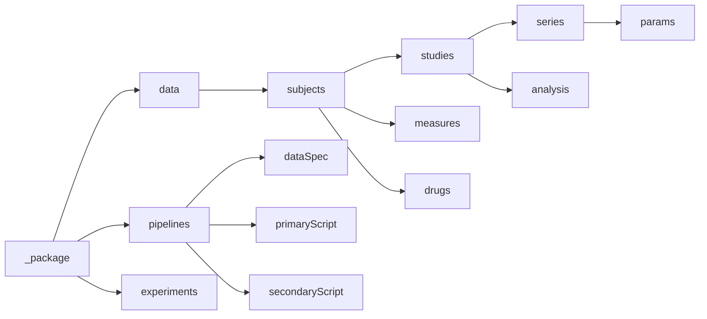

# Package root

## Description
Meta-data about the squirrel package is stored in the root of the .json document.

## JSON variables
|Variable|Type|Description|Example|Required?|
|---|---|---|---|---|
|`_package`|JSON object|
|`data`|JSON object|

## File Structure
`/`
