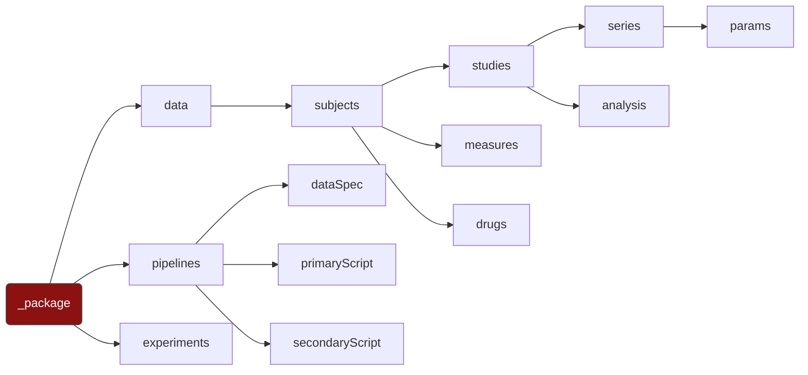

# _package

## Description
Meta-data about the squirrel package is stored in the root of the .json document.

## JSON variables
|Variable|Type|Description|Example|Required?|
|---:|---|---|---|---|
|`format`|string|Defines the package format|Squirrel|Yes|
|`version`|string|squirrel format version|1.0|Yes|
|`iDBVersion`|string|The NiDB version which wrote the package|2022.4.780||
|`name`|string|Short name of the package	MRI data export	Yes|
|`description`|string|Longer description of the package||
|`date`|datetime|Date the package was created|2022-04-30 13:34:12|Yes|
|`subjects`|JSON array|

## File Structure
`/`
