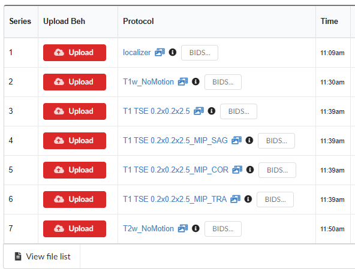

# Importing Data from a Redcap Project

## Step1

Gather the following information from Redcap administrator for API connection .&#x20;

* Redcap Server
* Redcap API Token

## Step 2

Use 'Projects' menu in NiDB to get to the desired project's main page. From Data Transfer section of the links on the right, click "Import from Redcap" link.

 (1) (1).png>)

## Step3

* Enter the Redcap server address and API token information and press "Update Connection Settings" button on the right as shown below.
* Press "Show Project info" button to check the connection is establish. The information from connected redcap project will be appeared as shown in the figure below.

## Step 4

Next step to import the data correctly from redcap into NiDB is mapping each variable / field from redcap to NiDB. To start mapping Click on the "Map This Project" button at the end of screen as shown in the above figure. A new page will appear as shown below.

.png>)

Each Redcap form is required to map separately. Pick a Redcap "Form" from the drop-down list shown above.

Select a type of data that redcap form contains. NiDB handles this in three types of data, which are following:

* Measures: Redcap forms storing cognitive measures and similar other measures are stored as this data form in NiDB
* Vitals: Redcap forms  that contains information of vitals like hearth rate, blood pressure, blood test results are stored as this form of data. Also any tests that need to be done multiple times in a day can be recorded as this form.
* Drug / Dose: If your project have information related to administrating drugs, this type of Redcap form is stored as Drugs / Dose in NiDB.

After choosing the Redcap "Form" and its type of data in NiDB, Click on the "Redcap Field Mapping" button as shown in the figure above.

A new section to map the variables from Redcap to NiDB will appear as shown in the figure below.

.png>)

A variable mapping table has two sides: Recap and NiDB.&#x20;

#### Redcap Variable Side

This side has four columns. Following is the explanation of each column on Redcap side.

* Event: A Redcap project can have multiple events. All the events will be listed in this column. Any number of events can be chosen from the list that is needed to map. In our example we chose only one event because the Redcap form selected tp map contain only data for that event.
* Form: Name of the Redcap form selected in the last step will be displayed here.
* Field: A drop-down list will list all the fields related to the selected Redcap form here. Choose one field at a time to map.
*   Field Type: There can be following five types of field:

    * date: Fields defined as date in Redcap.
    * time: Fields defined as time in Redcap
    * value: Fields containing the data&#x20;
    * notes: Field have some information regarding the collected data&#x20;
    * rater: fields that contains the name of the rater (if any)

    Defining the correct type of field is very crucial for the mapping in NiDB. Especially time and date are very important to create reports based on the information stored in NiDB.

#### NiDB Variable Side

The NiDB variable side contains three columns. These columns will automatically filled with the same variable and instrument names based on the Redcap side. However, one can change these names. These are the names that will be stored in NiDB for corresponding Redcap Form and variable names.

After defining one variable in a form, hit "Add" button on the right to add this mapping definition.&#x20;

In case of any mistake, a mapping item can be deleted and later can be added again according to the above stated process.

## Step 5

The last step is to recheck all the mapping information. It is important, because the integrity, and accuracy of data transfer is based on accurate mapping. So check, recheck and make it sure!

After you have done with your mapping, you are ready to transfer the data from Redcap to NiDB.

You can complete all the mapping for the Redcap Forms to be exported first and then transfer one by one OR you can transfer the data of one and then go to the next forms to map and transfer.

To transfer the data, Just press the "Start Transfer" button on the left at the at of the variable mapping table. The data will be transferred for the selected form.

You need to transfer the data for each mapped table separately by going back to each one.&#x20;

Reports on data can be generated by using the "Analysis Builder" tool, selection from a project's main page from "Tools" section on the right.
