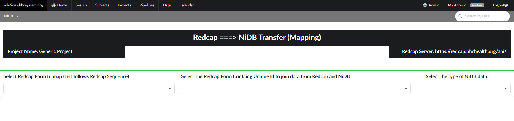
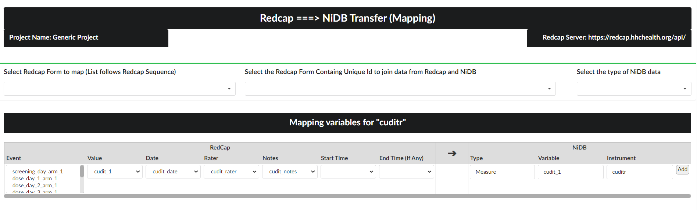

# Importing Data from a Redcap Project

Redcap is a widely used web-based data management tool to manage clinical research data. NiDB provides an interface to import data from a Redcap project to a NiDB project. This is a very useful option in various scenarios like: migration of a project from Redcap to NiDB, OR managing data for some modalities in Redcap and rest in NiDB then merging the data in NiDB.&#x20;

The following are the steps to import data from Redcap.

### Step 1

Gather the following API information from **Redcap administrator** to connect with the Redcap project.

* **Redcap Server**&#x20;
* **Redcap API Token**

### Step 2

Use **Projects** menu in NiDB to get to the desired project's main page. From **Data Transfer** section on the right side of the project's main page, click **Import from Redcap** link.

 (2).png>)

### Step 3

Enter the Redcap server address and API token information and press **Save Connection Settings** button on the right as shown below.

Then press **Show Project Info** button to establish the API connection with the Redcap server. If the connection is successful, the information from connected redcap project will be appeared as shown in the figure below.

In case of an error, please recheck the **Redcap Server** and **Redcap API Token** information provided above and hit the **Show Project Info** button again. If problem persists, please contact to the the Redcap administrator.

 (2) (1).png>)

### Step 4

Next step to import the data from Redcap into NiDB is mapping each form and variable / field for Redcap and NiDB project.  The correct mapping is crucial to accurately import the data.

To start mapping Click on the **Map This Project** button at the end of screen on the right as shown in the above figure. A new page will appear as shown below.

<figure><figcaption></figcaption></figure>

### Step 5

Each Redcap form is required to map separately. Pick a Redcap form **** from the **Select a Redcap Form** drop-down list as shown above. You can type the name of the Redcap form as well.

Now select the Redcap form containing "unique id" to map the subjects in Redcap and NiDB.&#x20;


The corresponding NiDB and Redcap projects should hold a field containing unique Ids for the subjects to be mapped.


Next, select an appropriate type of NiDB data representing the selected Redcap form. In NiDB, Redcap data is defined as the following three types:

* **Measures**: Redcap forms that store measures like cognitive and other measures are defined as **Measures** in NiDB
* **Vitals**: Redcap forms that contains information like hearth rate, blood pressure, blood test results are stored as this form of data. Also daily repeated measures should be recorded as this type.
* **Drug / Dose**: Redcap forms that store information regarding administration of drugs, will be stored as this type in NiDB.

As you select the type of NiDB data, a new section to map the fields from Redcap to NiDB variables will appear as shown in the figure below.

<figure><figcaption></figcaption></figure>

### Step 6

The variable mapping table has two sides: Recap and NiDB.

**Redcap Variable Side**

This side has seven columns. Following is the explanation of each column on Redcap side.

* **Event**: A Redcap project can have multiple events. All the events will be listed in this column. Any number of events can be chosen from the list that is needed to map. In our example we chose only one event because the Redcap form selected to map contain only data for that event.

The next six columns define the fields of the "selected Redcap Form" in the last step

* **Value**: Select the field that carries value / data
* **Date**: Select the field that hold the "date" information corresponding to the value field.
* **Rater**: Select the field having the "rater" information corresponding to the value field.
* **Notes**: Select the field having the "notes" information corresponding to the value field.
* **Start Time**: Select the field that hold the "initial time" or "time" information corresponding to the value field.
* **End Time** : Select the field that hold the "end time" information corresponding to the value field.


If you have only one time field corresponding to the value, then use the "Start Time" column to define the time field and left the "End Time" field empty


**NiDB Variable Side**

The NiDB variable side contains three columns. These columns will automatically filled with the same **Variable** and **Instrument / Form** names based on the Redcap side. However, one can change these names. These are the names of variables and Redcap forms that will be stored in NiDB for mapping these items for all the later imports.

After defining one variable in a form, hit **Add** button on the right to add this mapping definition.

In case of any mistake, a mapping item can be deleted and later can be added again according to the above stated process.

The mapping of each variable is a time taking task. However this is very important step mapping and need to be done only once. Once the structure is defined, it will be stored in NiDB and imports for further data can be performed with the click of a button.


**However, the mapping needs to be updated accordingly as the structure of the corresponding redcap project is altered.**


### Step 7

The last step is to recheck all the mapping information. It is important, because the integrity, and accuracy of data transfer is based on accurate mapping. So check, recheck and make sure!

After you have done making sure that your mapping is correct, you are ready to transfer the data from Redcap to NiDB.


You can complete the mapping for the all the Redcap forms to be exported first and then transfer the data one by one OR data can be transfer for one form at a time and then go to the next to map and transfer.


To transfer the data, first select the redcap field corresponding to the unique subject id in both NiDB and Redcap. A list of variables from the above selected redcap form for this purpose will be available. If you did not select the Redcap form for this purpose in Step , then it will show all the variables of the Redcap project. After selecting the right variable:

Press the **Start Transfer** button on the far right. It will start transferring data for the selected form.

You need to transfer the data for each mapped form separately by selecting it as mentioned in the step 4 above.

Reports on data can be generated by using the [Analysis Builder](../analysis-builder.md) tool.
