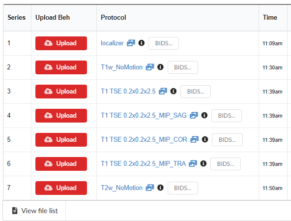

# Exporting BIDS format

NiDB can export imaging data in BIDS format, through the Search page, and through the pipeline system. All exported BIDS data must have a mapping established before the data is exported. This makes sure that the exported BIDS data is valid.

## BIDS Mapping

BIDS mappings are set on a project level. This means any mapping applied to an imaging study will be applied to all imaging studies within the same project. On a _Project_ **→** _Subject_ **→** _Study_ page, there is a **BIDS...** button next to each series name.

<figure><figcaption></figcaption></figure>

Click the **BIDS...** button for the series you want to map. You will need to do this for all series that you will want to export in BIDS format. After clicking the button, you will see a mapping.

<figure><figcaption></figcaption></figure>

The top of the page shows the current series being mapped. The saved mapping will only apply to the Series Description, Image Type, and Project.

<table data-full-width="true"><thead><tr><th>Field</th><th>Description</th><th>Example usage</th></tr></thead><tbody><tr><td><strong>entity:suffix</strong></td><td>BIDS entity:suffix for the MR modality (<a href="https://bids-specification.readthedocs.io/en/stable/appendices/entity-table.html">docs</a>). Special note - The <code>fmap:magnitude1and2</code> is meant for Siemens scanners where a single series contains two magnitude images.</td><td><code>anat:t1w</code></td></tr><tr><td>IntendedFor - <strong>Entity</strong></td><td>If this series is intended to be used for another series, for example if this is a fieldmap, you must specify which series it will apply to. A single fieldmap can be IntendedFor multiple BOLD series. The <strong>entity</strong> of the target series must be specified.</td><td>All IntendedFor fields must have the same number of items. This example has two runs of a Stroop task, so there must be 2 items for all of the IntendedFor mapping fields.  <code>func,func,func</code></td></tr><tr><td>IntendedFor - <strong>Task</strong></td><td>The <strong>task</strong> of the target series must be specified. It can only contain alphanumeric characters (no spaces, underscore, dash, etc) and must match another Task </td><td><code>Stroop,Stroop,GoNoGo</code></td></tr><tr><td>IntendedFor - <strong>Run</strong></td><td>The run number(s) of the target series must be specified.</td><td><code>1,2,1</code></td></tr><tr><td>IntendedFor - <strong>Suffix</strong></td><td>The entity of the target series.</td><td><code>bold,bold,bold</code></td></tr><tr><td>IntendedFor - <strong>FileExtension</strong></td><td></td><td><code>nii.gz,nii.gz,nii.gz</code></td></tr><tr><td><strong>Run number</strong></td><td>If there are multiple runs on the same task, then a run number of required. This maps to the <code>run-&#x3C;index></code> field in the BIDS image filename.</td><td>For example, if a study contains series named "Stroop 1" and "Stroop 2", then add those corresponding numbers for each run. If the study contains multiple runs of series with the same name (for example "Stroop", "Stroop"), then select Automatically number runs, and an ordinal number will be assigned to the consecutive series of the same name.</td></tr><tr><td><strong>Task</strong></td><td>A task name is required for BOLD series, and is good practice to identify particular series of data. This maps to the <code>task-&#x3C;label></code> field in the BIDS image filename.</td><td><code>Stroop</code> or <code>Rest</code> or <code>GoNoGo</code>, etc.</td></tr><tr><td><strong>Acquisition</strong></td><td>This is not required, but this maps to the <code>acq-&#x3C;label></code> field in the BIDS image filename.</td><td><code>OlinStroopRun1</code></td></tr></tbody></table>

Click **Update** when done. After all necessary series are mapped, the study page will look like this:

<figure><figcaption></figcaption></figure>

