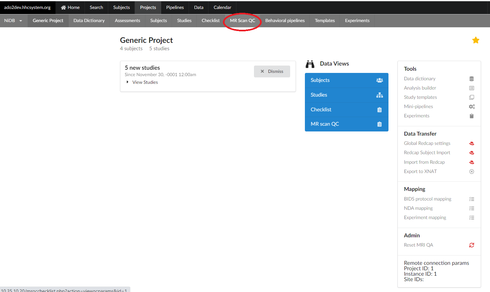
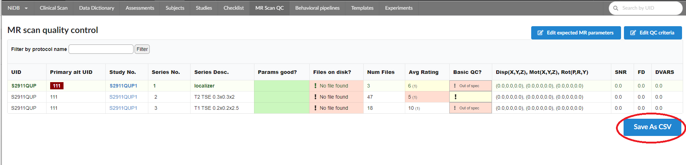

# MR scan quality control

MR scan parameters defining the quality of a MR scan are displayed on this page. The information is available for each NiDB project. This MR scan quality information page can be accessed from project's main page by clicking on the "MR Scan QC" sub-menu as shown below.

<figure><figcaption></figcaption></figure>

The MR scan quality control page shows the following information for each MR scan stored in the corresponding project. These parameters includes:

* **Series Desc. :** Description of the MR scan
* **Params good?** :  Green if parameters are within range. Yellow if criteria is not defined and Red if parameters are out of specified range
* **Files on disk?** : Green if files are found on the specifies location on the disc. Red if the files are found on the specified location.
* **Num Files** : Actual number of files&#x20;
* **Avg Rating** : Average ratings
* **Basic QC** : Red if parameters are out of specification, yellow if limit is not defined and green for within range
* **Disp (X,Y,Z)** : X, Y and Z displacement value
* **Mot(X,Y,Z)** : Motion in X, Y and Z direction.
* **Rot(P,R,Y)** : Rotation pitch, roll and yaw values.
* **SNR** : Signal to noise ratio
* **FD** : Frame-wise Displacement
* **DVARS** : Root mean square of temporal change of the voxel-wise signal at each time point. (D is for temporal derivative of timecourses, VARS refers to RMS variance over voxels.)&#x20;

<figure><figcaption></figcaption></figure>

The QC scan quality control table can be download as ".csv" file by clicking "Save As CSV" button at the end of the MR QC table.&#x20;
